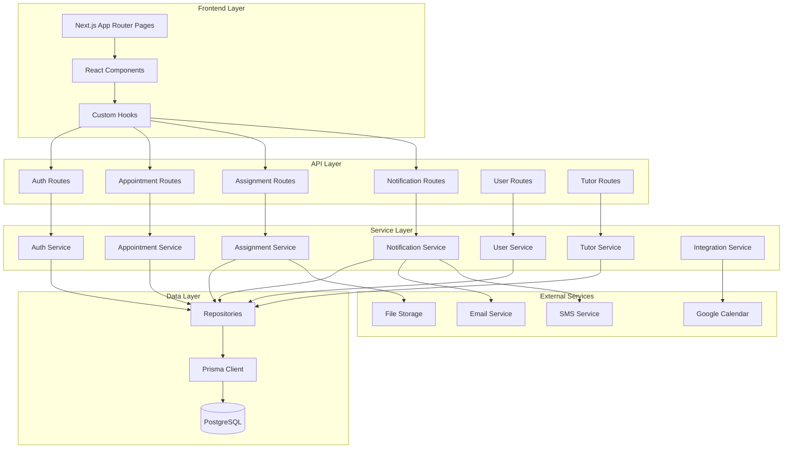
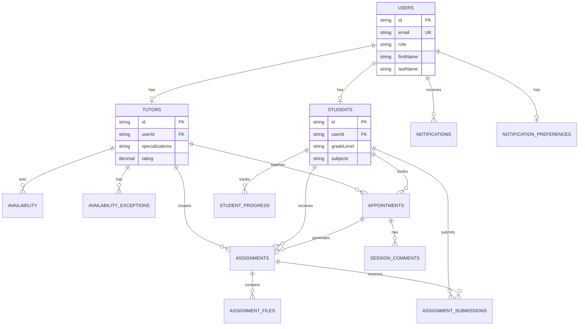
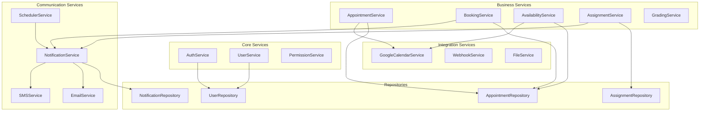
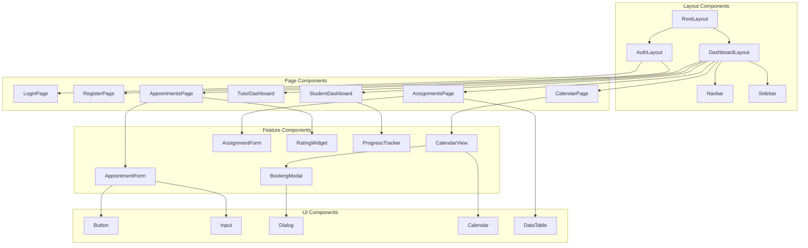
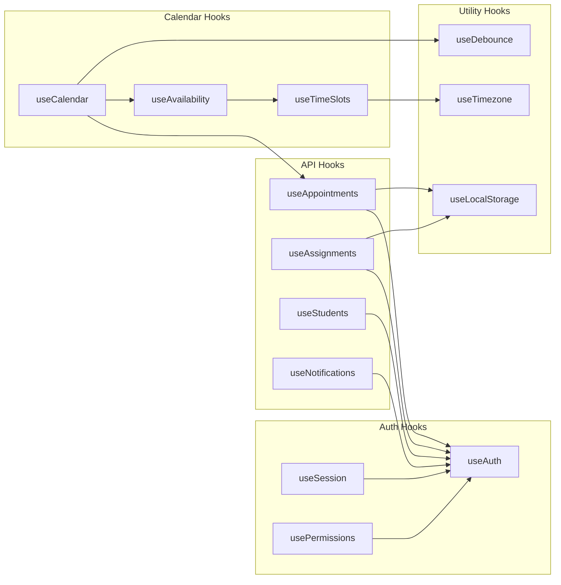
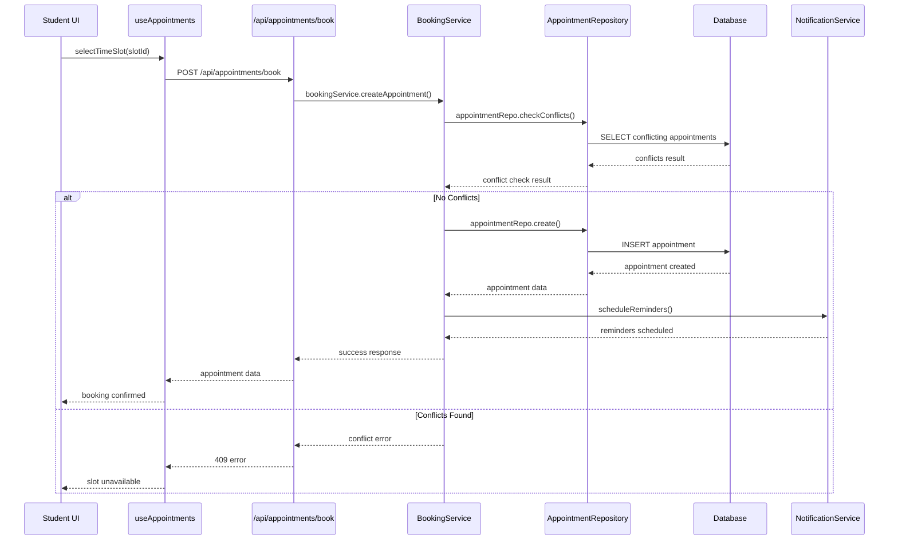
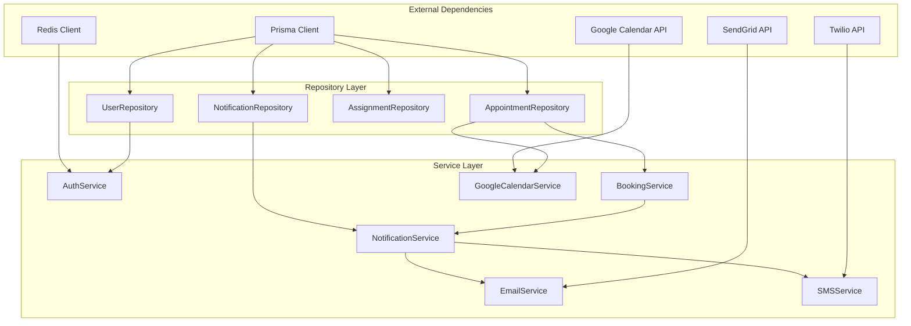
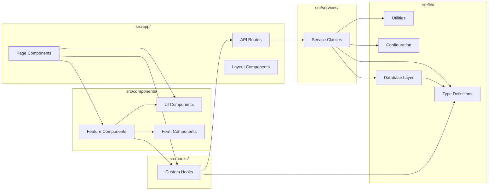

# System Architecture Diagrams

This document provides visual representations of the tutoring calendar application's architecture, showing relationships and connections between files, classes, and functions.

## 1. High-Level Architecture Overview



## 2. API Routes to Services Mapping

```mermaid
graph LR
    subgraph "API Routes (/api/)"
        A1[auth/register/route.ts]
        A2[auth/login/route.ts]
        A3[appointments/route.ts]
        A4[appointments/book/route.ts]
        A5[assignments/route.ts]
        A6[notifications/route.ts]
        A7[students/[id]/progress/route.ts]
        A8[tutors/availability/route.ts]
    end

    subgraph "Services (/services/)"
        S1[auth/auth.service.ts]
        S2[appointment/appointment.service.ts]
        S3[appointment/booking.service.ts]
        S4[assignment/assignment.service.ts]
        S5[notification/notification.service.ts]
        S6[user/user.service.ts]
        S7[appointment/availability.service.ts]
    end

    subgraph "Repositories (/lib/db/repositories/)"
        R1[user.repository.ts]
        R2[appointment.repository.ts]
        R3[assignment.repository.ts]
        R4[notification.repository.ts]
    end

    A1 --> S1
    A2 --> S1
    A3 --> S2
    A4 --> S3
    A5 --> S4
    A6 --> S5
    A7 --> S6
    A8 --> S7

    S1 --> R1
    S2 --> R2
    S3 --> R2
    S4 --> R3
    S5 --> R4
    S6 --> R1
    S7 --> R2
```

## 3. Database Relationships and Repository Pattern



## 4. Service Layer Architecture



## 5. Frontend Component Hierarchy



## 6. Custom Hooks Dependencies



## 7. Data Flow - Appointment Booking Process



## 8. Service Dependencies Graph



## 9. Function Call Flow - Assignment Creation

```mermaid
flowchart TD
    A[Tutor clicks 'Create Assignment'] --> B[AssignmentForm.onSubmit()]
    B --> C[useAssignments.createAssignment()]
    C --> D[POST /api/assignments]
    D --> E[assignmentService.create()]
    E --> F[validateAssignmentData()]
    F --> G[assignmentRepo.create()]
    G --> H[prisma.assignment.create()]
    H --> I[notificationService.notifyStudent()]
    I --> J[emailService.sendAssignmentNotification()]
    I --> K[smsService.sendAssignmentNotification()]
    J --> L[Assignment created & notifications sent]
    K --> L
    L --> M[Update UI with new assignment]

    style A fill:#e1f5fe
    style L fill:#c8e6c9
    style M fill:#c8e6c9
```

## 10. File Structure Relationships



## Diagram Legend

### Symbols Used:

- **Rectangles**: Classes, Services, Components
- **Cylinders**: Databases
- **Diamonds**: Decision Points
- **Circles**: Start/End Points
- **Arrows**: Dependencies/Relationships

### Color Coding:

- **Blue**: Frontend Components
- **Green**: Backend Services
- **Orange**: External Services
- **Purple**: Database Layer
- **Red**: Error/Conflict States

These diagrams provide a comprehensive visual overview of how all the components in the tutoring calendar application connect and interact with each other, making it easier to understand the system architecture and maintain the codebase.
